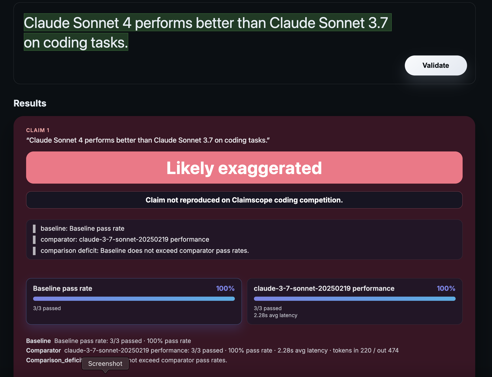

# Eval Receipts — Labs Edition

Eval Receipts ingests AI-lab evaluation claims, reproduces them with pinned, open harnesses, and publishes a shareable receipt per claim with a neutral status.



## Status

This repo is a work in progress. Expect rough edges, missing documentation, and breaking changes while we land the core workflows.

## Quick Start

```bash
git clone https://github.com/kevinshowkat/eval-receipts
cd eval-receipts
cp .env.example .env
# populate IDs for any providers you want to exercise
docker compose up --build
```

- Web UI: http://localhost:3000
- API: http://localhost:8000

## Repo Map

- apps/web — Next.js client
- apps/api — FastAPI service + workers
- packages/harness — evaluation adapters
- packages/shared — shared TS types
- docs — method cards and operational notes
- demo — example claims and artifacts

